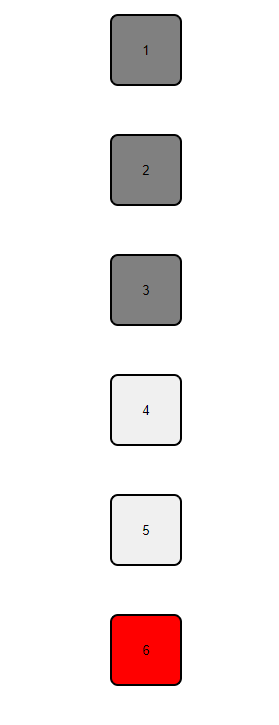
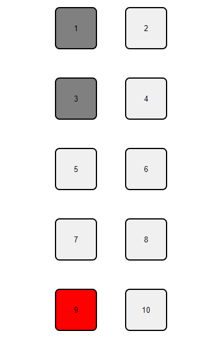
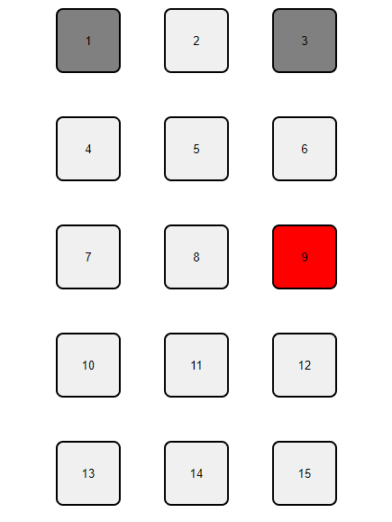

# Multiplication

Web application to help a child understand multiplication.

Grid of number from 1 - 144.

Clicking on a number (1-144) highlights the boxes and the multipliers of the selected number.

To identify the clicked and multipliers
  
  * Clicked - red
  * Multipliers - grey 

The grid will display as follow 
  * 1 column on mobile devices

    

  * 2 columns on tablets

    

  * 3 columns on desktops.

    


## installation

```bash
npm install
```

## running

Runs the app in `development mode` with `automatic reload` if you make changes to the code. Open `http://localhost:3000` to view it in the browser.

```bash
npm start
```
## building

Application will get bundled into `dist` folder.

```bash
npm run build
```

## testing

Tests are run using `React Testing Library` framework.

```bash
npm test
```